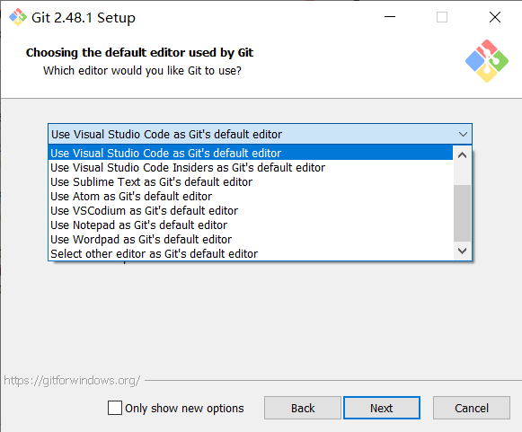
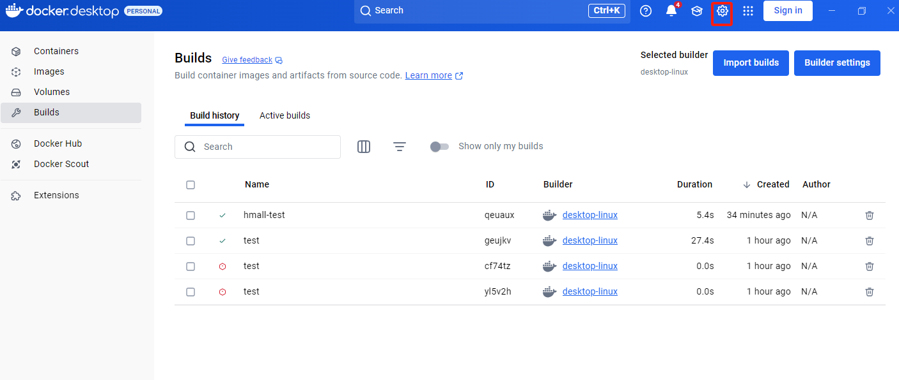
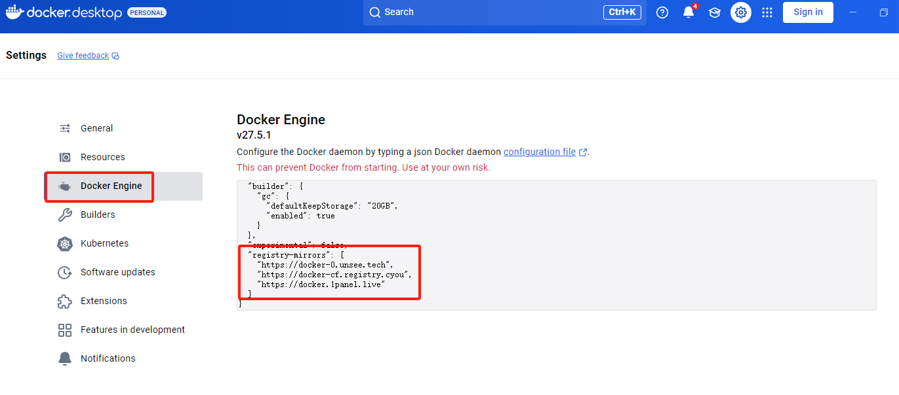
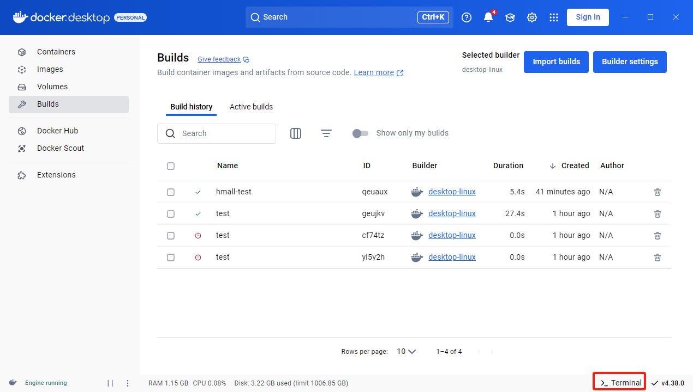
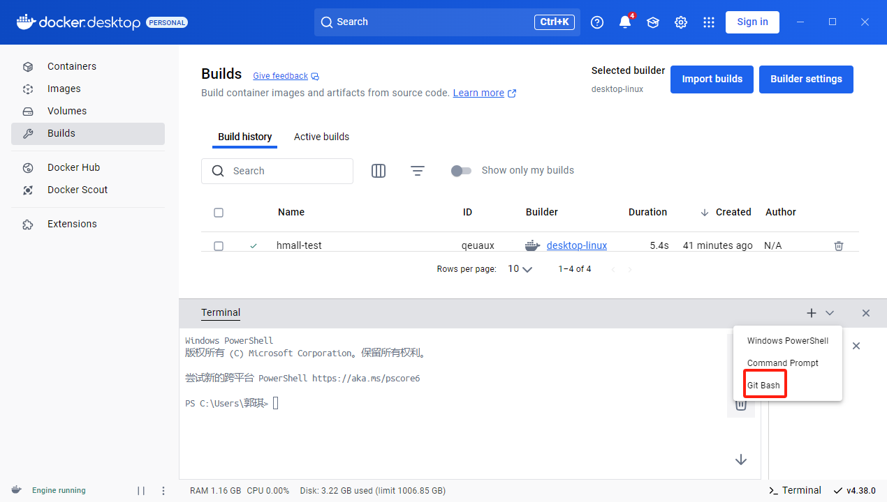
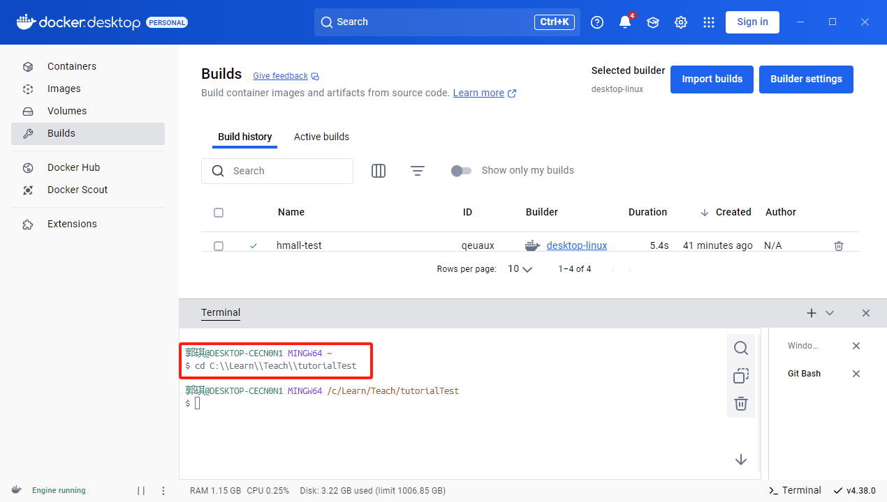
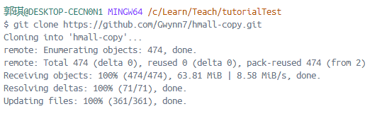
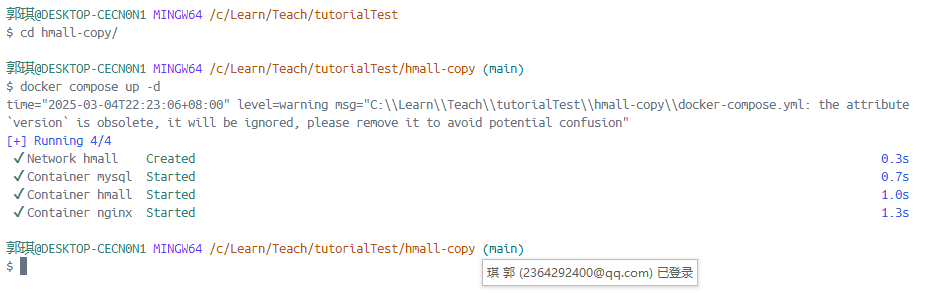

# 使用教程
## 1.1 软件安装（课前准备）
### 1.1.1 安装VS Code
教程链接：[https://zhuanlan.zhihu.com/p/698865320](https://zhuanlan.zhihu.com/p/698865320)
### 1.1.2 安装Git
教程链接：[https://www.cnblogs.com/ybqjymy/p/17226628.html](https://www.cnblogs.com/ybqjymy/p/17226628.html)

在选择默认编辑器时可以选用VSCode作为默认编辑器：

### 1.1.3 安装Docker Desktop
下载链接：[https://www.docker.com/get-started/](https://www.docker.com/get-started/)

下载完成之后，可以注册一个账号并登录，并且按照下图配置镜像源：


添加镜像源：
```json
"registry-mirrors": [
    "https://docker-0.unsee.tech",
    "https://docker-cf.registry.cyou",
    "https://docker.1panel.live"
]
```


## 1.2 docker一键部署


```shell
# 切换到要放置项目的文件夹位置
cd 放置项目的文件夹位置
```

```shell
git clone https://github.com/Gwynn7/hmall-copy.git

cd hmall-copy

docker compose up -d
```



打开浏览器，输入网址: http://localhost:18080
